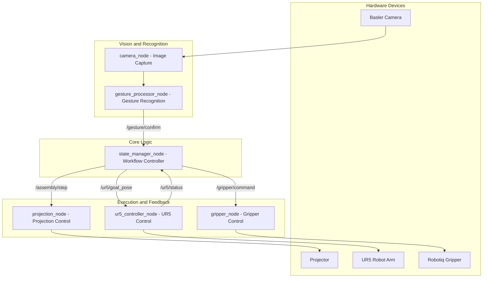

# Human-Robot Collaborative Assembly Assistance System

This project is a human-robot collaborative assembly system based on projection augmentation and gesture recognition. Assembly steps are projected onto the worktable to guide the operator. Camera-based gesture recognition confirms each step, triggering robotic arm and gripper actions to complete the assembly process.

---

## System Overview

### System Goals

- Display assembly steps using projection-based AR;
- Workers confirm each step via gestures;
- Camera detects gestures → triggers projection updates & robot actions;
- Robotic arm and Robotiq gripper perform the next task;
- Iterate steps until the entire assembly is complete.

---

## Hardware Components

| Module       | Model                         | Description                         |
|--------------|-------------------------------|-------------------------------------|
| Camera       | Basler acA2440-75gc           | Industrial camera for gesture detection and monitoring |
| Robotic Arm  | UR5                            | Collaborative arm with ROS2 support |
| End Effector | Robotiq 2F Gripper            | Two-finger gripper compatible with UR |
| Projector    | Any standard projector        | Projects step guidance onto the workspace |

---

## System Architecture Diagram (Layered)



| Node                     | Function                                        |
| ------------------------ | ----------------------------------------------- |
| `camera_node`            | Captures image stream from Basler               |
| `gesture_processor_node` | Detects gestures, outputs confirmation signal   |
| `state_manager_node`     | Manages steps, transitions, dispatches commands |
| `projection_node`        | Controls content shown on projector             |
| `ur5_controller_node`    | Sends motion commands to UR5                    |
| `gripper_node`           | Controls gripper open/close                     |

---

## ROS2 Node Details

The system follows a modular ROS2 architecture. Each core function is encapsulated in a ROS2 node, communicating via topics and services.

### 1. `camera_node`

- **Function**: Captures image stream using Basler Pylon SDK and publishes to ROS2 topics
- **Input**: Camera hardware stream
- **Output**:
  - `/image_raw` (`sensor_msgs/Image`): raw camera images
  - `/gesture/raw` (`sensor_msgs/Image`, optional): for visualizing cropped gesture area
- **Dependencies**:
  - `pypylon`, `OpenCV`, `rclpy`

---

### 2. `gesture_processor_node`

- **Function**: Processes incoming image stream and detects whether a valid confirmation gesture is made
- **Input**:
  - `/image_raw`: from `camera_node`
- **Output**:
  - `/gesture/confirm` (`std_msgs/Bool`): `True` when gesture is confirmed
  - `/gesture/debug_info` (optional): debugging info like bounding boxes, confidence scores
- **Technology**:
  - MediaPipe Hands / Custom CNN
- **Recognition Logic**:
  - Detection zone restriction  
  - Multi-frame confirmation  
  - Confidence threshold filtering

---

### 3. `state_manager_node`

- **Function**: Central workflow state controller implemented as a state machine
- **Input**:
  - `/gesture/confirm`: from gesture detection
  - `/ur5/status`: from UR5 control node
- **Output**:
  - `/assembly/step` (`std_msgs/Int32`): current step index
  - `/projection/display` (`std_msgs/String`): instruction text for projector
  - `/ur5/goal_pose` (`geometry_msgs/Pose`): next target pose for UR5
  - `/gripper/command` (`std_msgs/String`): "open" or "close"
- **Features**:
  - Supports step sequences defined in YAML or JSON files
  - Acts as the logic hub of the full system

---

### 4. `projection_node`

- **Function**: Displays current step instructions via projector
- **Input**:
  - `/projection/display` (`std_msgs/String`)
- **Output**:
  - Visual display (desktop/projector surface)
- **Implementation Options**:
  - PyQt5 / Pygame / Electron (with WebSocket interface to ROS2)

---

### 5. `ur5_controller_node`

- **Function**: Sends target poses to the UR5 robotic arm and monitors status
- **Input**:
  - `/ur5/goal_pose` (`geometry_msgs/Pose`)
- **Output**:
  - `/ur5/status` (`std_msgs/Bool`): `True` when motion is complete
- **Back-end**:
  - Uses `ur_robot_driver` + MoveIt2 for trajectory execution
- **Optional Extensions**:
  - Add support for velocity limits, path planning, and collision checking

---

### 6. `gripper_node`

- **Function**: Controls Robotiq 2F Gripper (open/close)
- **Input**:
  - `/gripper/command` (`std_msgs/String`): accepted values: `"open"` / `"close"`
- **Implementation**:
  - Based on Robotiq official ROS2 driver or integration via URCaps
---

## ROS2 Topic Communication Flow

```plaintext
camera_node
    └─> /image_raw ──> gesture_processor_node
                            └─> /gesture/confirm ──> state_manager_node
                                                             ├─> /ur5/goal_pose ──> ur5_controller_node
                                                             │                        └─> /ur5/status
                                                             ├─> /gripper/command ──> gripper_node
                                                             └─> /projection/display ──> projection_node
```

---

## Workflow State Machine Design

### Core Logic

1. System initializes and loads steps from a YAML file
2. Projector displays instruction for step **N**
3. Worker performs the action and shows a confirmation gesture
4. Gesture is detected → `/gesture/confirm` is published
5. `state_manager_node` performs:
   - Updates projection with the next instruction
   - Sends motion command to UR5
   - Sends gripper command ("open"/"close")
6. Waits for feedback from UR5 (`/ur5/status`)
7. Proceeds to next step
8. Repeats until all steps are completed

---

### Example Step Definition (YAML Format)

```yaml
steps:
  - id: 1
    name: "Install Motherboard"
    projection_text: "Place the motherboard in the top-left slot"
    ur_pose: pose_A
    gripper: "open"
    
  - id: 2
    name: "Insert Ribbon Cable"
    projection_text: "Insert the ribbon cable"
    ur_pose: pose_B
    gripper: "close"
```
Each step contains:

- **`id`**: Step index in the sequence
- **`name`**: Human-readable description of the step
- **`projection_text`**: Instruction text shown on the projector
- **`ur_pose`**: Named pose or pose identifier for UR5 motion
- **`gripper`**: Gripper action, typically `"open"` or `"close"`

These steps can be loaded dynamically at runtime from a YAML or JSON file by the `state_manager_node`.

---

## Tools & Technology Stack

| Module             | Recommended Tools / Technologies           |
|--------------------|--------------------------------------------|
| Camera Integration | Basler Pylon SDK + OpenCV                  |
| Gesture Recognition| MediaPipe / Custom CNN Model               |
| Robot Arm Control  | ROS2 + MoveIt2 + `ur_robot_driver`         |
| Gripper Control    | `robotiq_2f_gripper_control` (ROS2 package)|
| Projection Display | PyGame / PyQt5 / Electron + WebSocket      |
| State Management   | Python class-based FSM / SMACH             |
| Deployment         | ROS2 Workspace, optionally Dockerized      |

---

## ROS2 Topics & Services Overview

| Topic / Service         | Type                    | Description                              |
|--------------------------|-------------------------|------------------------------------------|
| `/gesture/confirm`       | `std_msgs/Bool`         | Gesture recognition result (`True`/`False`) |
| `/assembly/step`         | `std_msgs/Int32`        | Current step index                        |
| `/projection/display`    | `std_msgs/String`       | Instruction text for projection           |
| `/ur5/goal_pose`         | `geometry_msgs/Pose`    | Target pose for UR5                       |
| `/gripper/command`       | `std_msgs/String`       | Gripper command (`"open"` / `"close"`)   |
| `/ur5/status`            | `std_msgs/Bool`         | UR5 motion completion feedback            |

---

## Key Considerations

- **Gesture Recognition Robustness**:
  - Use a spatial detection zone
  - Require multi-frame confirmation
  - Apply confidence threshold filtering

- **Workflow Reliability**:
  - Central state machine ensures synchronization of gesture input, robot control, and visual feedback

- **Error Recovery**:
  - Include support for emergency stop and rollback

- **Scalability**:
  - Define workflows via YAML or JSON for flexible task expansion

---

## Future Extensions

- Add voice command or physical button as backup gesture confirmation
- Integrate visual inspection for quality control
- Implement web-based monitoring and log viewer
- Enable multi-station and multi-robot collaboration
- Log user actions and optimize with behavioral analytics

